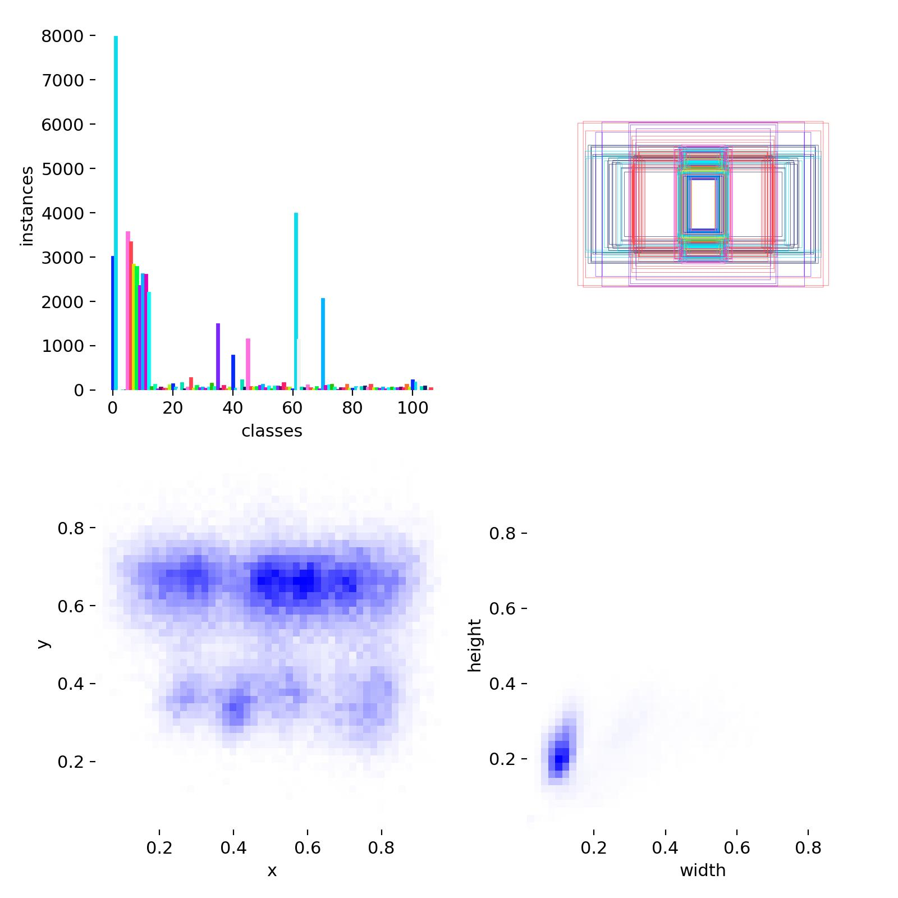
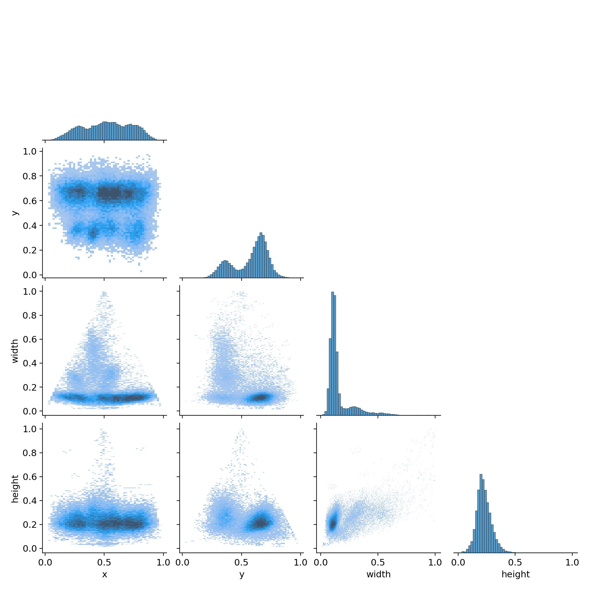
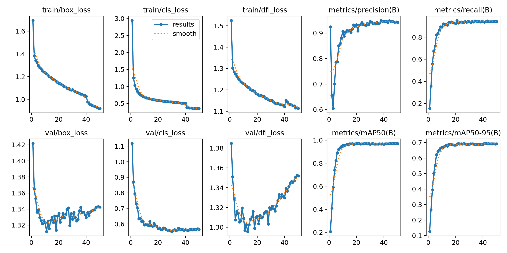

# Classifications_of_Bangla_License_Plate_Detection_using_YoloV8_Model

# Roboflow Dataset:
# Bangla License Plate Detection using YOLOv8

## 📌 Overview
This project focuses on detecting and classifying **Bangla License Plates** using the **YOLOv8** object detection model. The system is trained on a custom dataset containing Bangla license plates and achieves high accuracy with strong detection performance.

---

## Dataset Details

*   **Number of Classes:** 107
*   **License:** [Creative Commons Attribution 4.0 International (CC BY 4.0)](https://creativecommons.org/licenses/by/4.0/)

### Dataset Split

The dataset is divided into three sets for training, validation, and testing:

| Set        | Images | Percentage |
| :--------- | :----- | :--------- |
| **Train**  | 9447   | 87%        |
| **Valid**  | 898    | 8%         |
| **Test**   | 455    | 4%         |

### Preprocessing

The following preprocessing steps have been applied to the images:

*   **Auto-Orient:** Corrects the orientation of images based on EXIF data.
*   **Resize:** All images are stretched to a uniform size of 420x420 pixels.
*   **Grayscale:** Images are converted to a single-channel grayscale format.

### Augmentations

To improve model robustness, the following augmentations were applied, generating 3 outputs per training example:

*   **Shear:** ±15° Horizontal and ±15° Vertical.
*   **Noise:** Up to 1.85% of pixels have noise added.

## Classes

The dataset contains 107 classes, covering Bengali numerals, letters, and the names of districts as they appear on license plates.

#### **Numerals**
`0`, `1`, `2`, `3`, `4`, `5`, `6`, `7`, `8`, `9`, `102`, `103`, `105`

#### **Characters & Vehicle Class Letters**
`A`, `Ba`, `Bha`, `Cha`, `Chha`, `DA`, `Da`, `Dha`, `E`, `Ga`, `Gha`, `Ha`, `Ja`, `Jha`, `Ka`, `Kha`, `LP`, `La`, `Ma`, `Metro`, `Na`, `Pa`, `Raj`, `Sa`, `Sha`, `THA`, `Ta`, `Tha`, `U`, `V`

#### **District Names**
`Bagerhat`, `Bagura`, `Bandarban`, `Barguna`, `Barisal`, `Bhola`, `Brahmanbaria`, `Chandpur`, `Chapainawabganj`, `Chatto`, `Chattogram`, `Chuadanga`, `Cox-s Bazar`, `Cumilla`, `Dhaka`, `Dinajpur`, `Faridpur`, `Feni`, `Gaibandha`, `Gazipur`, `Gopalganj`, `Habiganj`, `Jamalpur`, `Jessore`, `Jhalokati`, `Jhenaidah`, `Joypurhat`, `Khagrachari`, `Khulna`, `Kishoreganj`, `Kurigram`, `Kustia`, `Lakshmipur`, `Lalmonirhat`, `Madaripur`, `Magura`, `Manikganj`, `Meherpur`, `Moulvibazar`, `Mymensingh`, `Naogaon`, `Narail`, `Narayanganj`, `Narsingdi`, `Natore`, `Netrokona`, `Nilphamari`, `Noakhali`, `Pabna`, `Panchagarh`, `Patuakhali`, `Pirojpur`, `Rajbari`, `Rajshahi`, `Rangamati`, `Rangpur`, `Satkhira`, `Shariatpur`, `Sherpur`, `Sirajganj`, `Sunamganj`, `Sylhet`, `Tangail`, `Thakurgaon`

## Usage with YOLOv8

This dataset is ready to be used for training a YOLOv8 object detection model.

2.  **Configuration File (`data.yml`):** Use the provided `data.yml` file to point the training script to the dataset.
    ```
    roboflow:
      license: CC BY 4.0
      project: various-vehicles-license-plate-in-bangla-fclxg
      url: https://universe.roboflow.com/engineering-3bqg7/various-vehicles-license-plate-in-bangla-fclxg/dataset/1
      version: 1
      workspace: engineering-3bqg7
 
    ```
3.  **Training Command:** You can start training with a command similar to this:
    ```bash
    yolo detect train data=path/to/your/data.yml model=yolov8n.pt epochs=100 imgsz=420
    ```

## License

This dataset is licensed under the **CC BY 4.0** license. This means you are free to:

*   **Share** — copy and redistribute the material in any medium or format.
*   **Adapt** — remix, transform, and build upon the material for any purpose, even commercially.

You must give appropriate credit, provide a link to the license, and indicate if changes were made.

### Dataset Visualization
| Label Distribution | Label Correlogram |
|--------------------|--------------------|
|    |  |

---

## ⚙️ Model Details
- **Model:** YOLOv8
- **Framework:** [Ultralytics YOLOv8](https://github.com/ultralytics/ultralytics)
- **Training Settings:**
  - Epochs: *Your number here* (replace)
  - Batch Size: *Your number here* (replace)
  - Optimizer: Adam / SGD
  - Learning Rate: *Your value here*

---

## ✅ Results
 
### Performance Metrics (Final Epoch)
| Metric       | Value     |
|-------------|-----------|
| **Precision**  | 94.24%   |
| **Recall**     | 94.15%   |
| **F1-Score**   | 94.19%   |
| **mAP@50**     | 96.98%   |
| **mAP@50-95**  | 69.25%   |
---

### 📊 Confusion Matrix
 
