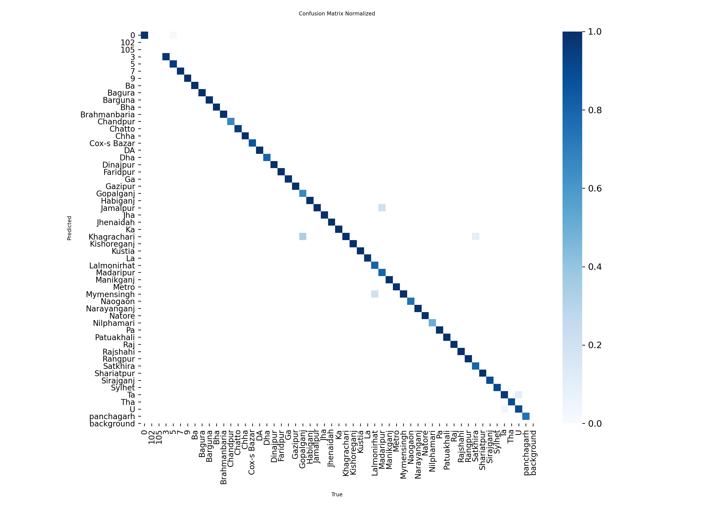

# Classifications_of_Bangla_License_Plate_Detection_using_YoloV8_Model

# Roboflow Dataset:
# Bangla License Plate Detection using YOLOv8

## 📌 Overview
This project focuses on detecting and classifying **Bangla License Plates** using the **YOLOv8** object detection model. The system is trained on a custom dataset containing Bangla license plates and achieves high accuracy with strong detection performance.

---

## 📂 Dataset
- **Total Classes:** Multiple classes (Bangla license plate categories)
- **Annotations:** YOLO format
- **Splits:**
  - Training: 80%
  - Validation: 20%

### Dataset Visualization
| Label Distribution | Label Correlogram |
|--------------------|--------------------|
|  |  |

---

## ⚙️ Model Details
- **Model:** YOLOv8
- **Framework:** [Ultralytics YOLOv8](https://github.com/ultralytics/ultralytics)
- **Training Settings:**
  - Epochs: *Your number here* (replace)
  - Batch Size: *Your number here* (replace)
  - Optimizer: Adam / SGD
  - Learning Rate: *Your value here*

---

## ✅ Results

### Performance Metrics (Final Epoch)
| Metric       | Value     |
|-------------|-----------|
| **Precision**  | 94.24%   |
| **Recall**     | 94.15%   |
| **F1-Score**   | 94.19%   |
| **mAP@50**     | 96.98%   |
| **mAP@50-95**  | 69.25%   |

---

### 📊 Confusion Matrix
*(Add your confusion matrix image in `results/confusion_matrix.png` and update the path)*
```markdown

